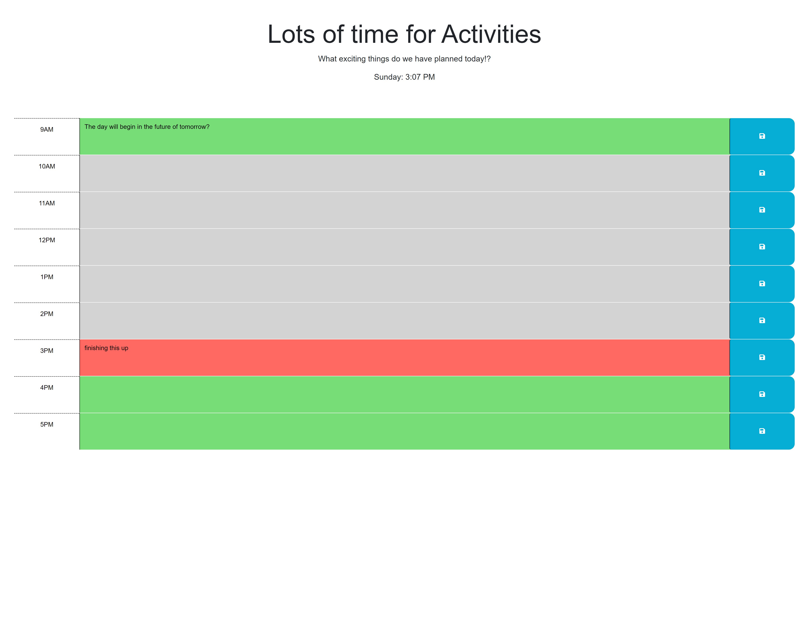

# Plan-the-day

## Description

This is a daily planner for use to plan your day in advance.

## Features

On this webpage your daily plans are displayed and can be changed as needed for helpful reminders

## How to Use

- 1. Access the homepage via an html link or by inputing the html manually
- 2. To input a plan for the corresponding hour, click on the text boxes between the time stamp and save button
- 3. Type in what ever activity or plan you want to keep track of and click the button with the save icon on it.
- 4. Now whatever you input is saved and will be displayed on the appropriate time stamp whenever the page is reloaded, until you save something new.
- 5. If you want to change a plan, simple click the text box again and input the new plan or activity and once again hit the save button.
- 6. Rinse and repeat adnosium until satisfied

## Live Link

https://massicottec.github.io/Plan-the-day/

## Github Link

https://github.com/massicottec/Plan-the-day

### Credits

massicottec
Georgeyoo
Xandromus
mfyke
courtthecoop